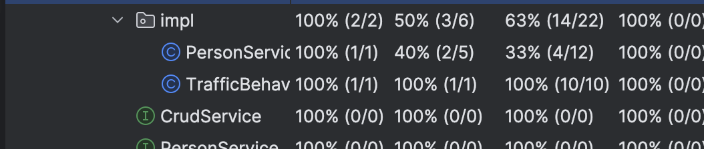
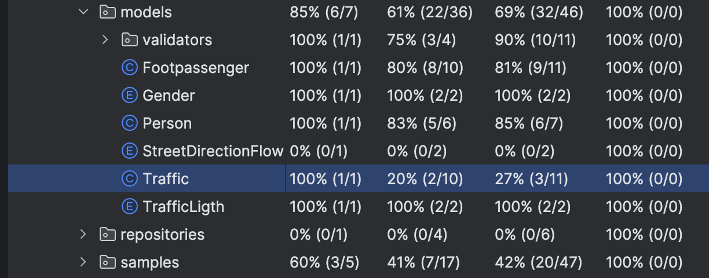

# پوشش آزمون (Test Coverage)

اعضای گروه ##

نگار نوبختی - 98171201

پریمهر مرصع‌فر - 98171148

## شرح آزمایش

مطابق با دستورالعمل پروژه json-simle، میزان coverage را برای پروژه CodeCoverageProject حساب می‌کنیم.

از نمونه بخش‌هایی که coverage آنها نیاز به بهبود دارد کلاس `PersonServiceImpl` و `Traffic` هستند.

