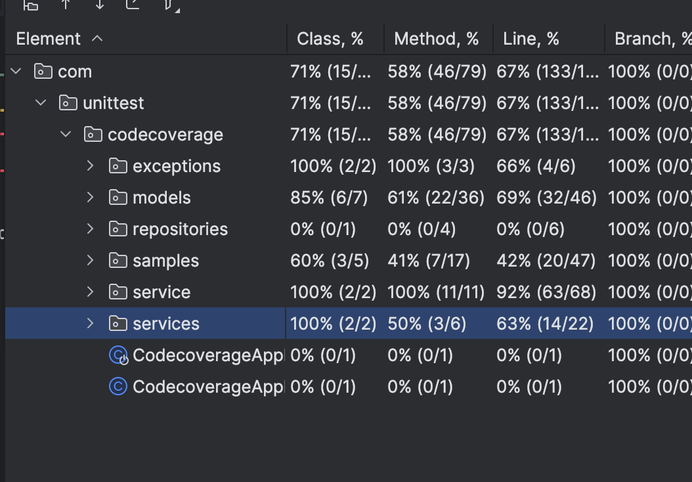
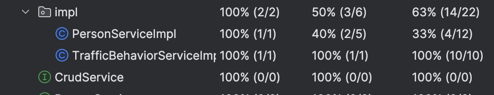

# پوشش آزمون (Test Coverage)

## اعضای گروه

نگار نوبختی - 98171201

پریمهر مرصع‌فر - 98171148

## شرح آزمایش

مطابق با دستورالعمل پروژه json-simle، میزان coverage را برای پروژه CodeCoverageProject حساب می‌کنیم.

از نمونه بخش‌هایی که coverage آنها نیاز به بهبود دارد کلاس `PersonServiceImpl` و `Traffic` هستند.

### افزایش پوشش `PersonServiceImpl`

از جمله توابعی که در این کلاس پوشش داده نشده تابع get است، که باید یک رشته غیرخالی دریافت کند و در غیر اینصورت یک `exception` پرتاب کند.

تست را به صورت زیر نوشته‌ایم تا رفتار تابع را بررسی کنیم.

در این تست خروجی تابع به ازای هر دو حالت بررسی شده تا آن را تماما پوشش دهد. مشاهده می‌شود که coverage در مقایسه با قبل از این تست (که تصویر آن در بخش قبل قرار دارد) به اندازه زیر می‌رسد:

همچنین برای آنکه مطمئن شویم بروزرسانی `Person`های موجود در `repository` درست انجام می‌شود، برای تابع `update` نیز تستی می‌نویسیم.

پس از تست coverage می‌بینیم که پوشش به مقدار زیر افزایش پیدا کرده:

و با مشاهده کلاس می‌توان بخش‌های پوشش داده شده را مشاهده کرد.

